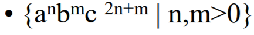

# Automata
Ejercicio para clase de IA

## Lenguaje

* n es menor que m
* n y m son mayores a 0

### Ejemplos:

* cuando n = 1, m = 2
abbcccc

* cuando n = 2, m = 3
aabbbccccccc

* cuando n = 3, m = 4
aaabbbbcccccccccc

* cuando n = 2, m = 5
aabbbbbccccccccccccccc

## Patrones en cadenas

* siempre están en el orden a, b ,c
* b siempre es mayor que a
* c siempre es mayor que a y b

G = {Σ, V, P, S}

Σ = {a, b, c}
V = {S, T}

P = {}
